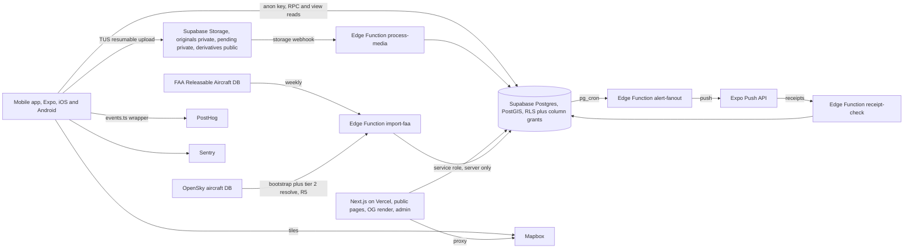

# PlaneSpotter, technical and UI specification

| Field | Value |
|---|---|
| File role | Architecture, tech stack, schema summary, RPC and function contracts, R5 resolution tiers, navigation and screen frame. Condensed from PlaneSpotterBuildPack-v1.8.md sections 2 to 8 and PlaneSpotterDesignSpec-v1.0.md sections 5 to 6 and 10 to 11. On conflict the BuildPack wins |
| Author | CKC |
| Version | 2.6 |
| Date | 2026-09-19 |
| Full SQL | BuildPack v1.8 section 3. Not duplicated here |

## 1. System context

## 2. Tech stack

| Area | Choice |
|---|---|
| Mobile | Expo SDK 54 plus, expo-router, TypeScript strict |
| Tabs | NativeTabs if Phase S spike passes, otherwise JS tabs with opaque bar |
| Lists | @shopify/flash-list |
| Images | expo-image, blurhash placeholder, variant TBD |
| Local queue | expo-sqlite |
| Push | expo-notifications, Expo Push API |
| Uploads | tus-js-client, Supabase Storage resumable endpoint, 6MB chunks |
| Backend | Supabase Postgres with PostGIS and pg_cron, Edge Functions, Storage |
| Maps | @rnmapbox/maps mobile, Mapbox Static Images via server proxy on web |
| Web | Next.js App Router on Vercel, ISR with tag revalidation |
| Analytics | posthog-react-native, posthog-js, only through packages/shared/events.ts |
| Errors | @sentry/react-native, @sentry/nextjs, through the redaction wrapper |
| Attribution | Android Play Install Referrer only, R4 |
| Monorepo | pnpm workspaces, apps/mobile, apps/web, supabase/, packages/shared |

Environment variables, SUPABASE_URL, SUPABASE_ANON_KEY, SUPABASE_SERVICE_ROLE_KEY server only, MAPBOX_ACCESS_TOKEN, MAPBOX_SECRET_TOKEN server only, EXPO_ACCESS_TOKEN CI, SENTRY_DSN_MOBILE, SENTRY_DSN_WEB, POSTHOG_API_KEY, ADMIN_ALLOWED_EMAILS. Secrets never in repo.

## 3. Data model

### 3.1 Write path and read path, R7

Every capture creates a `submissions` row. A `sightings` row is created only by `publish_submission`, with `airframe_id` not null, always. Media references the submission from upload and gets `sighting_id` stamped at publish. Worker execution requires authorization for the current content revision; entering awaiting_review never grants it. Derivatives are generated into the private `pending` bucket and copied to public `derivatives` at publish.

### 3.2 Table summary

| Table | Purpose | RLS and grants |
|---|---|---|
| users | Profile, handle, trust_tier, home_airport, strike_count, anonymized_at. Never hard deleted, auth row restricted, R10 R12 | Public columns only via grant, own row update via update_profile |
| operators, airports | Reference | Public read, service write |
| airframes | Canonical aircraft, stub flags, hero_sighting_id override | Public read, service write |
| airframe_registrations | Registration history with valid_from, valid_to, resolution_source | Public read, service write |
| registration_prefixes | Generated from packages/shared/registration-prefixes.json | Public read, migration write |
| airframe_operator_history, aircraft_source_records, import_conflicts | Reference and quarantine | Service only except operator history public |
| submissions | Write path; content_revision, review_required, approved_revision/kind/by/at, caption_hidden, lease_until/token, processing_attempts, resubmit_count | Own rows through the explicit BuildPack section 4 column allowlist; no direct caption, approved_by, approval_kind or lease_token. Approval is the get_my_submissions is_approved boolean only. Client edits via RPC |
| sightings | Read path, exists only after publish, captured_geo private, display_geo public, own caption_hidden set at commit from is_suppressed, caption null while hidden | Direct select revoked, published_sightings view only, privacy via is_suppressed helper, app_reader has no grant on policies |
| media | Original plus three derivative paths, derivatives_bucket pending or derivatives, phash, exif | Direct select revoked, paths via view or get_my_submissions |
| identification_proposals | Verified users propose a registration on an awaiting_identification submission | Own and open proposals for verified tier |
| moderation_actions | Every state transition, actor, from, to, reason, payload snapshot, target_ref. No cascades, R12 | Service only; owner RPC exposes sanitized last-action summary without actor identity or raw payload |
| publish_jobs | Durable generation; waiting_authorization, revision snapshot, lease/token, private nonce, intended-key manifest, cleanup_completed_at | Service only; parked jobs are not runnable; nonce/manifest cannot reset before cleanup |
| purge_jobs | Deletion, suppression change, anonymize work | Service only |
| follows | User to airframe or airport, created_via deliberate or onboarding | Own rows via toggle_follow |
| votes | Spot votes, count denormalized by trigger | Own rows via toggle_spot |
| device_push_tokens | Push tokens with permission state | Own via register_push_token |
| alert_events | Logical alert, one per user per airframe per 24-hour bucket by unique index, opened_at, session_attributed_at | Own read on safe columns, mark_alert_opened |
| alert_deliveries | One row per device per event, sending lease, send_attempt_id, retry_count constrained to 0 or 1 | Service only; pending-only normal claim; one recovery retry; responses fenced by attempt |
| flags, user_reports, user_blocks, terms_acceptance, sighting_corrections, aircraft_privacy_policies, owner_claims | Safety | Per BuildPack v1.8 section 4 |

### 3.3 Submission state machine, exhaustive

| From | To | Who | Trigger |
|---|---|---|---|
| none | received | user | create_submission |
| received | processing | user | finalize_submission after TUS completes |
| processing | awaiting_identification | system | process-media, registration_text null |
| processing | awaiting_review | system | process-media, review_required true or author not eligible for trusted_auto |
| processing | published | system | current trusted_auto authorization, review_required false, media ready, all commit guards pass |
| awaiting_identification | awaiting_review | user or moderator | registration_text set via update_submission or accepted proposal |
| awaiting_review | published | system on moderator authority | moderator authorizes expected revision, worker commits only while that approval remains valid |
| awaiting_review | rejected | moderator | admin reject with reason, prior values snapshotted |
| rejected | awaiting_review | user | update_submission, R11, increments resubmit_count once, cap 3; clears approval, sets review_required, parks job or requests cleanup |
| processing, awaiting_review | quarantined | system | publish_submission resolved ambiguous |
| processing, awaiting_review | awaiting_identification | system | publish_submission resolved invalid |
| processing | rejected | system | sweeper after 3 processing failures, reason processing_failed, not counted in resubmit_count |
| awaiting_review | processing | system | media readiness/preflight finds missing derivatives, parks job, clears approval, starts one regeneration cycle; review_required preserved |
| quarantined | awaiting_review | moderator | import conflict resolved |
| any except published, cancelled | cancelled | user | cancel_submission |
| published | cancelled | user | delete_sighting, sighting set deleted |

Anything not in this table is a no-op inside advance_submission. Adding a row here requires CKC approval. Approval is revision metadata, not an extra submission state. Every actual transition is audited; no-op retries do not add duplicate actions. BuildPack section 5.5 defines lock order, authorization and cleanup. The published transition is allowed only after its full guards pass.

### 3.4 R5, registration resolution tiers, plus identity over time

| Tier | Source | Trust | Behavior |
|---|---|---|---|
| 1 | FAA Releasable Aircraft Database, including the deregistration file for valid_from and valid_to | Authoritative | Weekly import, conflicts to import_conflicts |
| 2 | OpenSky aircraft database | Lower, never overrides tier 1 | Monthly load into aircraft_source_records. On a tier 1 miss, resolve_airframe creates an enriched stub. Verify license and attribution before ship |
| 3 | User-created stub | Unverified | Prefix and format pass, no record anywhere, pending stub |

resolve_airframe(p_registration, p_taken_at) returns matched, stub_enriched, stub_pending, ambiguous, or invalid. Exactly one registration row whose validity covers taken_at is a match. Two or more covering rows, or a taken_at before the earliest valid_from where history exists, is ambiguous and quarantines the submission with an import_conflicts row. No rows falls to tier 2 then tier 3. Invalid prefix or format sends the submission to awaiting_identification and creates nothing.

Prefix data is one JSON file, `packages/shared/registration-prefixes.json`, 106 rows. `registration-prefixes.ts` reads it at build time, `generate-prefix-migration.ts` emits the SQL, CI fails on drift. Validator normalizes first, strip whitespace and hyphens then uppercase, charset [A-Z0-9]{2,10}, longest prefix on the stripped form, B and VP families disambiguated by the next character, pattern rows enforce the pattern, pattern-less rows enforce a 1 to 5 alphanumeric suffix. Equivalent forms resolve identically, tested. Cross-checked against a secondary list citing FAA JO 7340.2 on 2026-09-19. Annex 7 sign-off remains Phase 0 gate 4.

Hub implication, first Phase S hub GA or domestic-heavy to keep tier 3 volume low.

## 4. RPC contracts

Full table in BuildPack v1.8 section 5.1. Service-only functions raise unless auth.role() is service_role. User RPCs call the private guarded transition helper after ownership checks; they do not invoke a service-only endpoint with a user JWT.

| Function | Caller | One line |
|---|---|---|
| create_submission(p jsonb) | user | Idempotent insert on (user_id, client_submission_id), state received, no resolution |
| update_submission(id, p) | user | Caption/registration in received, processing, awaiting_identification, awaiting_review or rejected only. Content changes increment revision and clear approval. Reopening requires moderator review, cap 3; parks job or requests cleanup, never grants authorization |
| cancel_submission(id) | user | Any state except published, purge job |
| finalize_submission(id) | user | received to processing, enqueue process-media |
| get_my_submissions(states) | user | Explicit owner JSON, masked caption, permitted media paths, sanitized last action and is_approved boolean; no raw approval metadata, moderator identity or worker tokens |
| advance_submission(id, to, reason) | service | Endpoint around private transition helper; guarded transitions and audit. Returning to awaiting_review never arms publication |
| resolve_airframe(reg, taken_at) | service | Section 3.4 |
| publish_submission(id) | service | Returns JSON job status and nullable sighting_id. Requires current authorization to arm parked job; preflight is inside claimed, not a stage. Persist intended keys before copy; final commit checks revision, approval, state and unexpired token. Cleanup completes before failed/reset. Full lifecycle in BuildPack section 5.5 |
| authorize_submission(id, expected_revision, kind) | service | Moderator or eligible trusted_auto authorization for current contents only; complete media required; cleanup must finish before arming |
| propose_identification(id, reg, note) | verified user | One proposal per proposer per submission |
| toggle_spot, toggle_follow, mark_alert_opened, delete_sighting, delete_account, update_profile, get_feed, search_entities, register_push_token | user | As BuildPack v1.8 section 5.1, toggle_follow records created_via, delete_account anonymizes per R10 |

Owner mutation responses. create_submission, update_submission and finalize_submission return explicit owner JSON per BuildPack section 4, never the submissions composite, including idempotent returns. Approval is exposed only by get_my_submissions: `(approved_revision IS NOT NULL AND approved_revision = content_revision AND approved_at IS NOT NULL)` as is_approved. Last-action summaries omit actor identity, kind and raw payload/reason.

Publication lock contract. Use transaction-scoped `pg_advisory_xact_lock(hashtext('airframe:' || airframe_id::text))` and the registration variant `pg_advisory_xact_lock(hashtext('registration:' || registration_id::text))`, with canonical UUIDs. Acquire applicable distinct keys in ascending signed numeric order, then submission rows, then publish_jobs rows. Publication and registration-specific policies take both identity keys; airframe policies take the airframe key. Follow BuildPack section 5.5 for identity revalidation and retries.

Phase ownership. The full authorization, manifest cleanup and fenced pipeline in these contracts is Phase 0 work, tested by all 15 Phase 0 gates, including gates 12 to 14. Phase S is the internal happy-path slice plus crash-recovery gate 7, within 5 to 6 weeks; no production release until Phase 0 hardening passes.

Client rules. Reads via the view and RPCs only. Push payload data `{ alert_id, sighting_id, airframe_id }`, the app calls mark_alert_opened with alert_id before navigating. TUS URL and expiry in the local queue, new session with the same submission id on expiry. All timestamps UTC ISO 8601.

## 5. Edge Functions and web routes

| Function | Trigger | Behavior |
|---|---|---|
| process-media | Storage webhook/finalize; atomic processing claim with lease_token, content_revision and bounded attempt count | Single media row and private derivatives. Writes require current token/revision/state. Preserves review_required on reprocessing; authorizes trusted_auto only when eligible. Reject after third failed/expired attempt, never during an active third attempt |
| alert-fanout, receipt-check, publish-runner, sweeper | pg_cron | Section 6 and BuildPack v1.8 section 5.2 |
| purge-runner | pg_cron every 5 min | purge_jobs, three buckets, Vercel revalidate, map snapshot purge, 5 attempts |
| import-faa | Weekly | Registrations with valid_from and valid_to from the deregistration file |
| import-opensky | Monthly, R5 | Tier 2 source records |
| import-backfill | Manual | Submissions with concierge_backfill, taken_at from manifest, same pipeline, never alerts |

Processing feasibility, Phase S gate. Supabase documents 256 MB and 2 s CPU per Edge Function request. Benchmark on 24 MP JPEG and HEIC. Fallback, queue-driven worker outside Edge Functions. Input limits 30 MB and 8000 px long edge at TUS.

| Web route | Purpose |
|---|---|
| /aircraft/[airframe_id] | Canonical Passport, R8, stable across reassignment, all links and alerts point here |
| /aircraft/[reg] | Alias, one current holder 302 to canonical, history renders a disambiguation page |
| /s/[id], /airport/[icao], /spotter/[handle] | Public pages from the view, ISR |
| /api/og/[sighting] | Share derivative, omits airport and date when suppressed |
| /api/mapsnapshot/[asset] | Opaque Mapbox proxy, unsuppressed only, purgeable |
| /admin/* | Submission queue by state, proposals, flags, conflicts, suppression, trust, hero override, audit, purge and push failures |

## 6. Alert fanout

Three objects. alert_events is the logical alert, alert_deliveries is the attempt per device, opened_at and session_attributed_at on the event are the return.

1. Enqueue. after insert on sightings, native_mobile only, taken_at within 7 days of published_at, R6. One alert_events row per eligible follower with window_key = floor(epoch / 86400), on conflict (user_id, airframe_id, window_key) do nothing. The unique index is the rate limit.
2. Send, every minute. Materialize deliveries per granted token. One logical event per notification; API batches contain up to 100 independent messages. Normal fanout claims pending only with a 2-minute lease and new send_attempt_id. Recovery alone claims expired sending attempts with no ticket after at least 10 minutes, atomically increments retry_count from 0 to 1 and rotates the attempt ID. Responses update only the matching attempt. Successful retries become sent; a second uncertain outcome becomes ticket_lost, with no third send. BuildPack section 6.2 is binding.
3. Verify, every 15 minutes. Receipt states stay provider_accepted/provider_rejected. Any acceptance wins; unresolved deliveries remain in flight. All-rejected events become provider_rejected; terminal sets containing failures and no acceptance become skipped, with reasons on deliveries. R9, acceptance is not device display.
4. Attribute, client. mark_alert_opened(alert_id) then navigate. session_attributed_at on a Passport or sighting view in session.

North Star, alert_events with session_attributed_at divided by alert_events with status provider_accepted, at 24 and 72 hours. Unit is the alert event. Opportunity metric beside it, share of activated collectors with at least one provider_accepted alert in 30 days.

## 7. Measurement contract

packages/shared/events.ts is the only analytics path. Exhaustive list. Adding one requires CKC approval.

submission_saved_local, submission_created, media_upload_completed, submission_state_changed with from_state and to_state, sighting_published, airframe_follow_created, airport_follow_created, notification_permission_prompted, notification_permission_resolved, alert_event_created, provider_receipt_resolved, alert_opened, attributed_session_started, passport_viewed, profile_viewed, portfolio_export_generated, share_card_generated, public_page_viewed, search_performed, spot_toggled, pro_interest_tapped, capture_step_reached with milestone in source, details, registration, caption, review.

Each event carries schema_version, hub, platform, ingestion cohort where relevant, UTC timestamp. Prohibited, raw EXIF, exact GPS, private media URLs, captions, emails, moderation notes.

Segment by hub, contributor and collector archetype, platform, acquisition source, native versus archive exposure, fresh versus old taken_at. Opportunity metric reported beside the North Star. Internal testers labeled and excluded.

Launch gates. Stage 1 hub activation, 15 recruited ambassadors, 10 onboarded, 5 publishing natively, seeded passport density, working moderation. Stage 2 promotion per hub has two gates. Supply gate, 20 active native contributors in 30 days, 100 native published sightings in 30 days, 30 distinct airframes with native sightings, 30 percent of those with two plus native contributors, moderation backlog p90 under 24 hours, no unresolved critical incident. Thesis gate O1, opportunity rate, return rate at 72 hours on complete windows only, minimum provider_accepted events, observation window, repeat contribution weeks, founder hours, each with continue, revise, stop thresholds. Values open, table in BuildPack v1.8 section 8.5. A hub cannot promote on supply alone. Build both as one dashboard query set.

## 8. Navigation frame

Five tabs, Home, Search, Capture, Alerts, Profile. Android native tabs cap at five. Capture raised accent circle where platform allows.

Alerts demotion rule. If under 20 percent of activated collectors receive at least one provider_accepted alert in a rolling 7-day window during beta, move Alerts under Home or Profile with an unread badge before public launch. Instrument this in Phase S.

Stack. Passport, sighting detail, airport page, other profiles push onto the current tab stack. Android back pops stack, then Home, then exits. Home scroll position preserved across pushes and background return, loss is a bug.

Deep links mirror web routes one to one. /s/[id], /aircraft/[airframe_id], /airport/[icao], /spotter/[handle]. Push opens sighting detail, not the alert list, and carries alert_id.

## 9. Screen inventory, P0, with mock status

| Screen | Binding behaviors | Mock |
|---|---|---|
| Home feed | Segments All and Following, infinite scroll, position restore, new-content pill not auto-jump, pull to refresh, native and Archive distinct, offline cached with passive banner | Card feed dark, done |
| Sighting detail | Zoomable image, landscape viewer, safe EXIF subset collapsible, tappable registration, photographer, airport, Spot and share in bottom bar, swipe prev-next with tap zones, report in overflow, compact privacy-safe map | none |
| Aircraft Passport | Above the fold, registration, hero with scrim, regLarge mono, history strip of three most recent sightings by distinct contributors with dates, then full-width Follow primary, then stats row sightings, contributors, first seen, airports, Timeline and Map segments, hero ranked by unique Spots with admin override, stub metadata never authoritative, thin passport honest copy | none |
| Capture flow | 4 UI steps, source plus details, registration, caption, review. 5 telemetry milestones. EXIF prefill editable, nearest-airport chip, explicit Location unknown, unreadable-registration path saves with registration_text null into awaiting_identification and shows Needs a registration, duplicate warning states block or confirm, publish persists locally and returns immediately, target median under 60 s, fully offline, storage-pressure stop | none |
| Upload queue | Every state visible per DESIGN.md section 6, retry and cancel where valid, cancel confirms and explains removal | none |
| Search | Segments Registrations, Airports, Spotters, load more not infinite, zero-result registration offers Add the first sighting prefilled, local history with clear | none |
| Airport page | Header with follow airport, standard feed lens | none |
| Airframe map | In-app Mapbox dark, clusters, time filter All time, This year, This month, suppressed absent with privacy footnote | none |
| Profile | Avatar 64, handle, display name, home airport, TrustBadge if Verified, stats row, feed lens by user. Own adds Edit, portfolio export, Settings entry. No follow or message button on others | none |
| Alerts | Rows with mono registration, thumbnail, relative time, tap to detail, unread on surface2, four empty states | none |
| Settings | Account, Notifications reflecting real permission with Fix in Settings, Appearance, Pro row passive Coming later, Legal, Support, Sign out, Delete with typed confirmation | none |
| Auth and onboarding | Email plus platform sign-in, handle claim with availability, terms recorded. Onboarding three beats, premise, identity, seeding. Home airport first, recurring airframes, types, rare last. Counter toward five follows, Continue never gated. No permission prompt. Hub gate screen with waitlist where eligibility applies | none |
| Moderation states | Pending ribbon on own cards, rejection as inbox row in Alerts with reason, first-publish explainer once | none |
| Report and block | Bottom sheets under ten seconds, block states effect | none |
| Value-moment sheet | Copy in DESIGN.md section 7, first deliberate airframe follow after onboarding only, rule 7.2.10 | none |
| Share card | DESIGN.md section 8 | none, blocked on name |
| Admin console | Desktop, light, stock kit, three panes, submission queue by state, identification proposals, item with flags, action bar plus audit. Keyboard first. Typed reason for destructive. Keep separate dominant over merge | none |

Phase S delivers the card mock plus a click prototype for browse scenarios. Remaining mocks are produced in the phase that builds the screen.

## 10. Public web

Dark token set, static where possible, image is the largest contentful element. Sighting page, Passport page, spotter page, airport page. Pagination or load more, never infinite scroll. ARIA feed role. WCAG 2.2 AA. Footer with legal, support, takedown.

## 11. Cost model

Not yet built. MVP v1.3.2 section 17 defines the drivers and the guardrail metric, infrastructure cost per retained active contributor or collector. Numbers needed before Stage 2 promotion at any hub.

Inputs to estimate at 1k and 10k MAU. Supabase compute and storage tier, Storage egress for derivatives, Edge Function invocations for process-media and cron, Mapbox tile and static image requests, Expo push volume, PostHog events, Sentry events, Vercel bandwidth. Assume 3 photos per active contributor per week and 20 feed sessions per collector per week as first-pass load.
